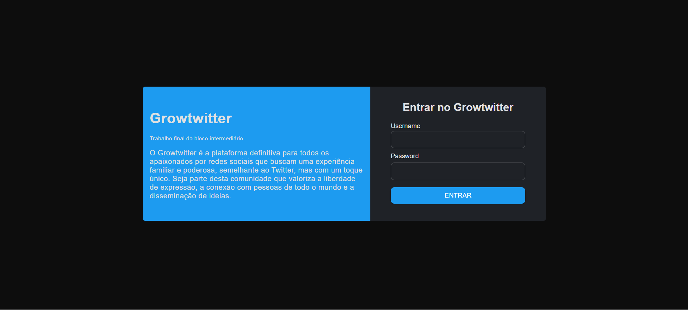
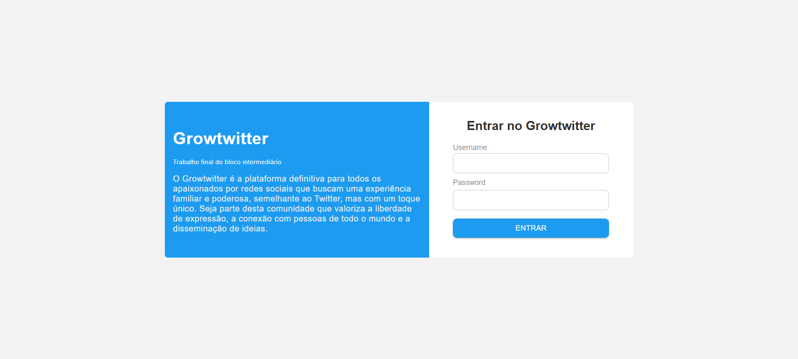
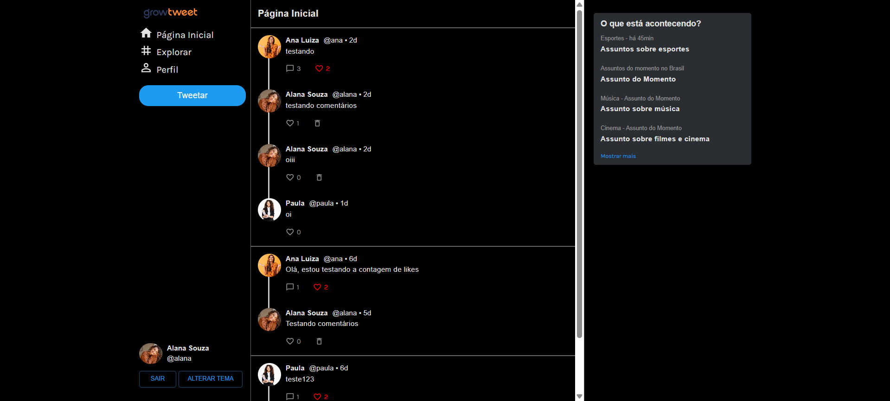
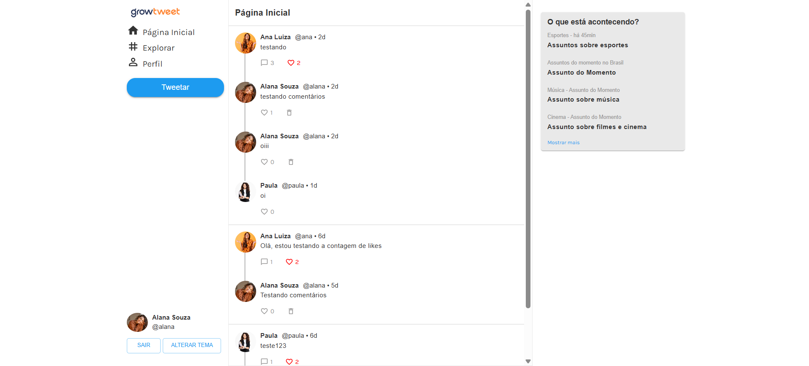
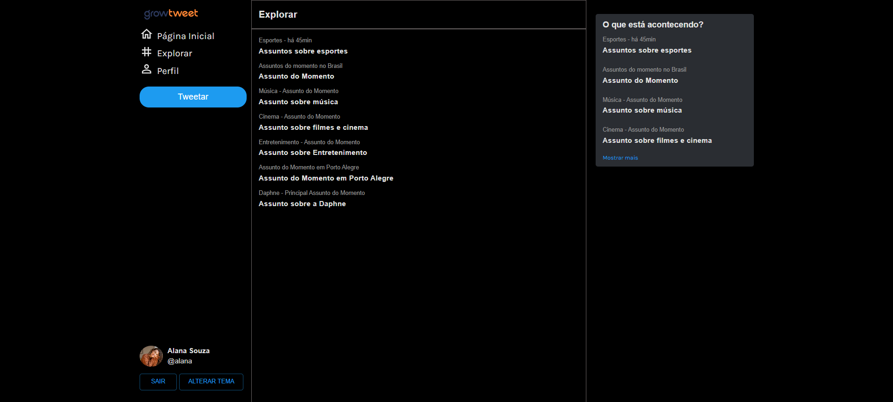
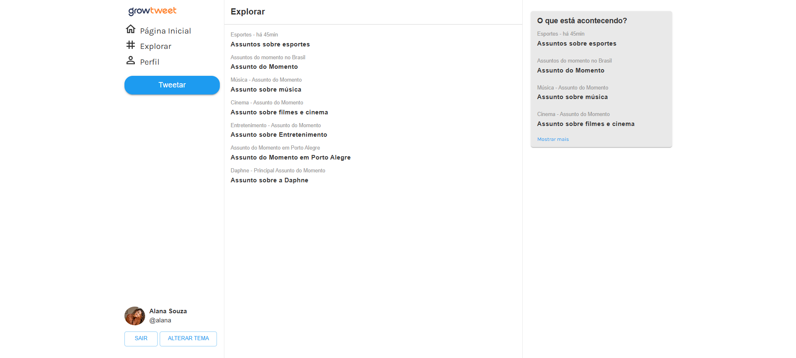
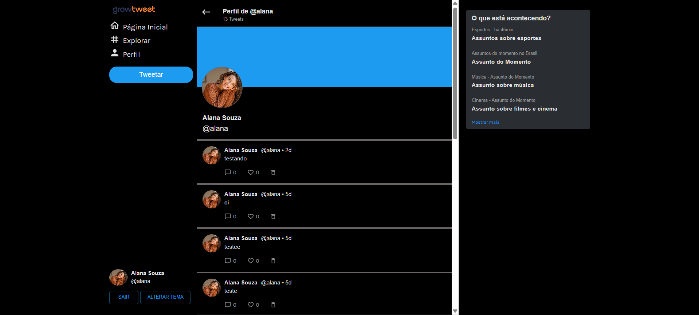
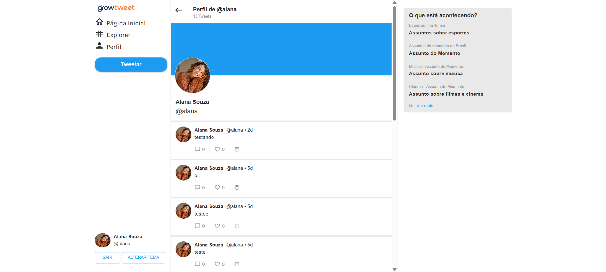

  

Um projeto inspirado no Twitter, desenvolvido como desafio da GrowDev, com foco em interação social, feed personalizado e experiência de usuário moderna.

<h2>
  
  Objetivo do Projeto
</h2>

Criar um site no qual os usuários possam:

- Criar tweets e compartilhá-los com seguidores.
- Seguir e deixar de seguir outros usuários (mecanismo de followers).
- Curtir e descurtir tweets, com contador de likes.
- Responder a tweets (comentários do tipo "reply").
- Visualizar feed personalizado (apenas tweets dos usuários que sigo).
- Visualizar o próprio perfil com todos os tweets publicados.
- Excluir seus próprios tweets.
- Navegar entre páginas protegidas apenas após login.

<h3>Diferencial</h3>
O feed é personalizado e restrito aos usuários que você segue, proporcionando uma experiência mais realista e focada, além de interações completas como likes, replies e gerenciamento de posts.

<h2>
  
  Tecnologias Utilizadas
</h2>

 **React.js** – Biblioteca para construção de interfaces modernas e reativas.

 **TypeScript** – Superset do JavaScript com tipagem estática, aumentando a segurança do código.

 **Vite** – Bundler rápido e leve para desenvolvimento frontend.

 **Material UI** – Biblioteca de componentes estilizados e responsivos.

 **Redux / Redux Toolkit** – Gerenciamento global de estado da aplicação.

<h3>Diferenciais do projeto</h3>

- Alternância entre tema Dark e Light, proporcionando uma experiência personalizada para o usuário.

- Feed personalizado exibindo apenas tweets de usuários que você segue.
- Funcionalidades completas: criar tweets, curtir/descurtir, responder e excluir tweets.

<h2>
  
  Funcionalidades implementadas
</h2>

- **Autenticação**: Apenas usuários logados podem acessar páginas protegidas.
- **Feed Personalizado**: Exibe apenas tweets dos usuários que você segue.
- **Perfil do Usuário**: Mostra todos os tweets do usuário logado.
- **Reply/Comentários**: É possível responder a qualquer tweet.
- **Excluir Tweet**: Usuários podem apagar seus próprios tweets.
- **Curtidas**: Cada usuário pode curtir ou descurtir posts, com contador atualizado em tempo real.
- **Tema Dark/Light**: Permite alternar entre tema escuro e claro.

<h2>
  
   Protótipo & Telas
</h2>

A seguir, algumas telas inspiradas no protótipo do projeto:

<table width="100%">
  <tr>
    <th>Tela</th>
    <th>Dark</th>
    <th>Light</th>
  </tr>

  <tr>
    <td>Login</td>
    <td></td>
    <td></td>
  </tr>

  <tr>
    <td>Página Inicial</td>
    <td></td>
    <td></td>
  </tr>

  <tr>
    <td>Explorar</td>
    <td></td>
    <td></td>
  </tr>

  <tr>
    <td>Perfil</td>
    <td></td>
    <td></td>
  </tr>
</table>

<h2>
  
  Links
</h2>

- Protótipo original: https://deploy-growtwitter.vercel.app/login
- Meu projeto online: https://growtwitter-1.onrender.com
- Repositório GitHub: https://github.com/Thaislaa/growtwitter

<h2>
  
  Usuários de teste
</h2>

| Usuário  | Senha  |
|----------|--------|
| growdev  | 12345  |
| karine   | 12345  |
| thais    | 12345  |
| toia     | 12345  |

  ✨ Desenvolvido por <strong>Thaisla da Veiga</strong>

